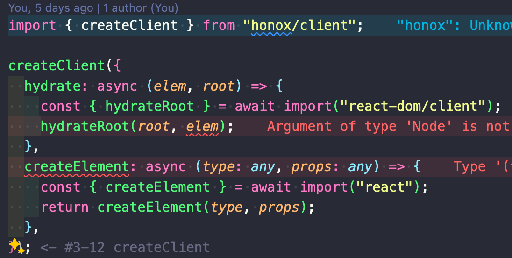
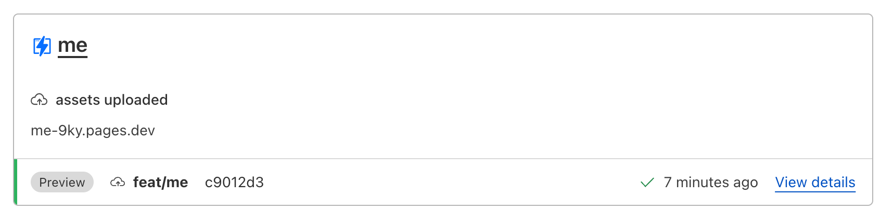

## 目次

## はじめに

`x-basic`を選択して`hono-create`する
```bash
npm create hono@latest
```


## ディレクトリの構造と役割

## レンダリングの仕組み
それぞれのrouteでは、Handler | MiddlewareHandlerの配列を返す。
createRouteはそのためのヘルパー関数。
default exportすることによって、GETリクエストのルートを書くことができます。
ContextとはRequestとResponseを操作するためのオブジェクト。

GETの他にも、そのルートに対して`POST`, `PUT`, `DELETE`メソッドを用いることができる。
`POST`, `PUT`, `DELETE`メソッドを用いる場合は、それぞれのメソッド名をexportする。

Honoオブジェクトをdefault exportすることで、APIエンドポイントを`routes`内に作成できる。


`_renderer.tsx`は`layout.tsx`的な立ち回り。

> The JSX Renderer middleware allows you to create a Renderer as follows

RendererはHono推奨の`@jsx/hono`


インタラクションを必要とするコンポーネントの場合、`app/islands`ディレクトリ配下に作成するまたは`_componentName.island.tsx`と命名する。islandsディレクトリ以下のコンポーネントをアイランドコンポーネントと呼ぶ。
default exportしていなければならない。

アイランドコンポーネントからは、Contextオブジェクトにはアクセスできない。そのため、アイランドコンポーネント外から必要な値を注入またはパスしてあげる必要がある。
```ts
import { useRequestContext } from "hono/jsx-renderer";
import Counter from "../islands/counter";

export default function SomeComponent() {
  const c = useRequestContext();
  return <Counter initVal={parseInt(c.req.query("initCounterVal") ?? "0")} />;
}
```

Cloudflare Pagesにデプロイ



Reactレンダラーを使用する
Reactレンダラーを使用することで、HonoxでReactが動くようになります。
つまり、Reactに依存しているUIコンポーネントの使用が可能になると言ってよいでしょう。
まず、以下に沿って進める。
https://github.com/honojs/honox?tab=readme-ov-file#react-case

hono依存のものを消す

フックもReactに

（honox依存のものは使用できるが、（honoxはhonoでファイルベースルーティングを可能にしてくれるメタフレームワークのため））`hono/css`など、hono依存のものは使えなくなる

? client.tsの型エラー

YamadaUIを使用する
viteはデフォルトでは全ての依存関係を外部化、つまりバンドルを開発中には行わず、プログラムの配布前にのみ行う。
これにより、開発とビルドの両方を高速化
しかしViteの**SSRでは**リンクされた依存関係はHMRを使用するため外部化しない、つまりSSRではリンクされたパッケージをバンドルに含めてビルドする
https://ja.vitejs.dev/guide/ssr.html#ssr-externals
しかし、外部化したくない、つまりリンクされたパッケージでもバンドルに含めずにビルドしたい場合には`ssr.externals`に入れる必要がある
`ssr.externals`に含める必要があるモジュール
1. ブラウザ環境でのみ使用されるパッケージ
例えばReactやReact DOMなどのクライアントサイドレンダリング用のライブラリは、サーバー側レンダリング時には不要です。

2. Node.js依存のパッケージ
Node.js依存のパッケージを ssr.external に含める必要があります。これにより、Viteはそのパッケージをバンドル化せずに、Node.js実行環境から直接読み込むようになります。
逆に ssr.external に含めないと、Viteはそのパッケージをバンドル化しようとしてエラーになってしまいます。
> Node.js環境に依存するパッケージをViteがバンドル化しようとしてエラーになる理由は、以下のようになります。
> Node.jsのコアモジュール(fs、path、cryptoなど)やNode.js固有の機能を使っているサードパーティパッケージは、通常のJavaScriptコードとは異なり、Node.js環境で動作することを前提としたコードになっています。
> 一方、ViteはウェブブラウザやWebアプリケーション向けにJavaScriptをバンドルするツールです。Viteは、ECMAScriptの仕様に沿ったJavaScriptコードしかトランスパイル(変換)できません。
> Node.js依存のコードには、Node.js固有のAPI、グローバル変数、モジュールシステムなどが使われています。これらはブラウザ環境では存在しないため、ViteがNode.js依存コードをそのままトランスパイルしようとするとエラーになります。
> 例えば、fsモジュールを使っているコードをViteがバンドルしようとすると、fsがブラウザ環境で定義されていないためエラーになります。
> そのため、Node.js依存コードをViteにバンドルさせずに、ssr.externalに含めることで、Node.js実行環境から直接それらのモジュールを読み込むようにする必要があるのです。
つまり、 ssr.external にNode.js依存のパッケージを列挙することで、Viteがそれらをバンドル化せずに、適切にサーバー側レンダリングできるようになるのです。

https://ja.vitejs.dev/config/ssr-options#ssr-%E3%82%AA%E3%83%95%E3%82%9A%E3%82%B7%E3%83%A7%E3%83%B3

```bash
11:17:53 AM [vite] Error when evaluating SSR module /@fs/Users/s002996/Develop/saku-apps/node_modules/react-fast-compare/index.js:
|- ReferenceError: module is not defined
    at eval (/Users/s002996/Develop/saku-apps/node_modules/react-fast-compare/index.js:125:1)
    at instantiateModule (file:///Users/s002996/Develop/saku-apps/node_modules/vite/dist/node/chunks/dep-DkOS1hkm.js:55036:15)

11:17:53 AM [vite] Error when evaluating SSR module /@fs/Users/s002996/Develop/saku-apps/node_modules/@yamada-ui/core/dist/index.mjs: failed to import "/@fs/Users/s002996/Develop/saku-apps/node_modules/react-fast-compare/index.js"
|- ReferenceError: module is not defined
    at eval (/Users/s002996/Develop/saku-apps/node_modules/react-fast-compare/index.js:125:1)
    at instantiateModule (file:///Users/s002996/Develop/saku-apps/node_modules/vite/dist/node/chunks/dep-DkOS1hkm.js:55036:15)

11:17:53 AM [vite] Error when evaluating SSR module /@fs/Users/s002996/Develop/saku-apps/node_modules/@yamada-ui/providers/dist/chunk-WVH6AECZ.mjs: failed to import "/@fs/Users/s002996/Develop/saku-apps/node_modules/@yamada-ui/core/dist/index.mjs"
|- ReferenceError: module is not defined
    at eval (/Users/s002996/Develop/saku-apps/node_modules/react-fast-compare/index.js:125:1)
    at instantiateModule (file:///Users/s002996/Develop/saku-apps/node_modules/vite/dist/node/chunks/dep-DkOS1hkm.js:55036:15)
```

静的ファイルを配信する
https://zenn.dev/knaka0209/scraps/14ec0f820346f6
`url('/static/dot-grid.png')`

ssrコンポーネントをislandsに入れるとhydrationerrorが出る！<islands-honox> hogehoge...
## 参考
https://github.com/honojs/honox
https://azukiazusa.dev/blog/full-stack-web-framework-honox/
https://trap.jp/post/1863/